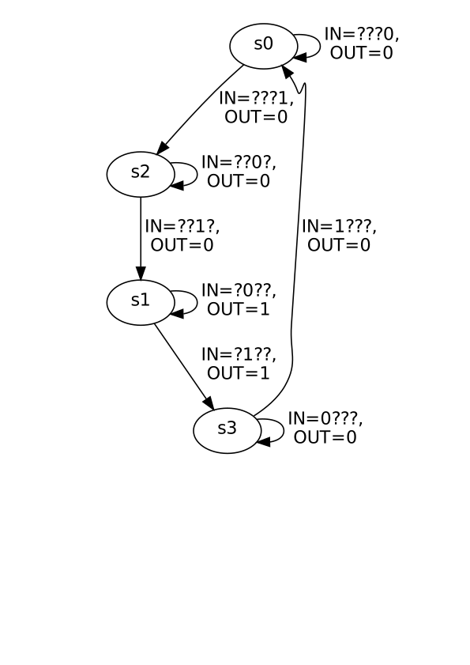
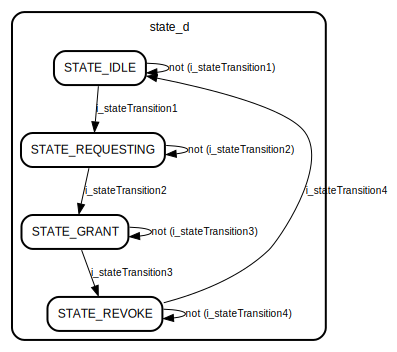

To generate an FSM diagram using Yosys:
```
yosys -s synthesisScript
python3 kiss2dot.py fsm.kiss2 > fsm.dot
xdot fsm.dot
```


Note: Place `(* fsm_encoding="auto" *)` next to the state register.

TerosHDL VSCode extension is capable of generating FSM diagrams as well. Note, it doesn't support the
conditional operator `?` and requires the use of `begin` and `end` enclosing an
`always_comb` process block.




