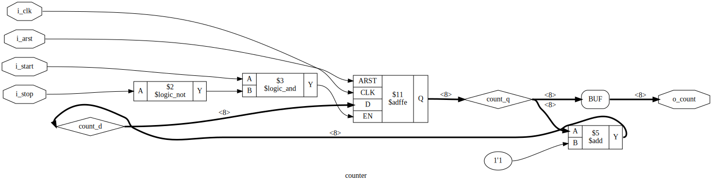

# Outputs from the synthesis scripts

`yosys -s synthesisScript`

`yosys -s synthesisScript2`

For more information, see: https://yosyshq.readthedocs.io/projects/yosys/en/latest/appendix/APPNOTE_011_Design_Investigation.html. 
